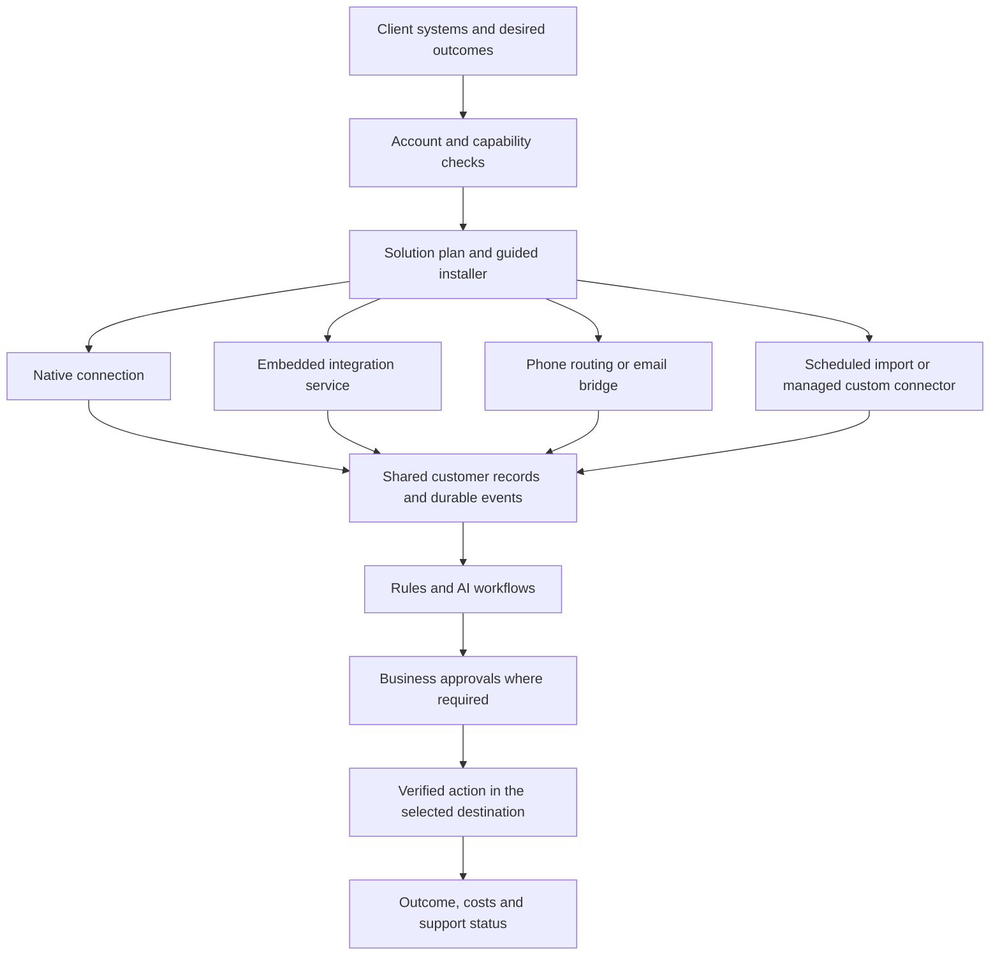

# Full-suite solutions for clients keeping their existing systems

September 4, 2026. Product and engineering blueprint based on repository inspection and current official provider documentation. This document describes the next implementation; it does not claim the proposed routing, embedded connectors or installer are already shipped.

## Product decision

Partners should have a full catalog of AI solutions and ordinary automations. The client keeps its existing tools wherever possible. The platform selects and operates an appropriate connection method for each enabled solution. A small set of tested combinations is useful for internal validation, not the boundary of the commercial product.

Sell business outcomes: answering inquiries, capturing and qualifying leads, keeping records current, assisting employees, arranging appointments, following up on estimates, collecting feedback and reporting results. Deterministic rules handle schedules, mappings and known conditions; models interpret conversations, extract facts and prepare drafts. Partner branding, client permissions and customer-action approvals apply across every execution method.

The intended sales position is: “Keep the systems your team already uses. We connect our AI and automations around them and handle the implementation.” A system with no authorized way to read or write data cannot support arbitrary automated operations; the installer must identify the exact alternative instead of claiming an unavailable integration succeeded.

## Architecture

The planner selects a method for each operation, not one method for the entire customer. A business may use native CRM writes, a routed AI phone number, provider-generated call notes, an embedded lead-source trigger and a branded approval portal at the same time.

## Connection methods

| Method | Appropriate use | Product work required |
| --- | --- | --- |
| Native API and events | Frequently used systems; strict latency or detailed control | Maintain narrow capabilities, account permissions, mappings, tests and recovery |
| Embedded integration service | Apps outside the native catalog that expose suitable triggers/actions through the service | Tenant-scoped connection flow, app/action discovery, provisioning, status, revocation and commercial agreement |
| Phone routing | Staff retain their phone system while AI handles a selected portion of calls | Per-client routing recipe, separate AI destination, distinct staff return destination, failure handling and rollback |
| Forwarded notifications/email | A vendor supplies notification messages or exportable summaries but no useful API | Sender verification, source-specific parsing, confidence checks and correlation to the original record |
| Scheduled exports/imports | Systems with usable file exports or periodic API access | Import scheduler, format validation, checkpoints and visible freshness; this cannot promise live availability |
| Managed custom connector | An authorized API exists but no maintained adapter fits | Escalation to platform engineering, contract test, review, release and reusable adapter |
| Approved browser/desktop automation | Legacy workflows accessible only through their authorized UI | A separate supervised agent, permissions, failure detection, secure sessions and maintenance; not currently implemented |

Fallbacks are chosen before activation. A timed-out write must not automatically switch to another connector and send the same action again. The shared delivery record remains authoritative for approvals, deduplication and uncertain outcomes.

## Concrete RingCentral installation recipes

### Staff first, AI for unanswered calls or after hours

Target behavior: callers use the same published business number. RingCentral rings staff normally. Configured unanswered or after-hours calls forward to the client's AI number. The AI conversation then runs through this platform's Twilio path; staff continue using RingCentral.

RingCentral documents external-number forwarding for supported call-handling rules, including unanswered and after-hours cases. This is a documented provider mechanism; applying it to a particular account still requires permission and a live test. [Official call-handling guide](https://developers.ringcentral.com/guide/voice/call-routing/user-call-handling/call-handling-rules).

Installer requirements: identify whether the entry point is a user, queue or IVR; discover applicable settings; capture existing rules; provision the scoped AI number; show the routing change; apply through a supported API or exact account-specific instructions; verify staff answer, no-answer, after-hours, caller identification and rollback. Do not port the existing number by default.

### AI first, staff keep their current phones

Target behavior: the chosen entry point forwards to AI first. A requested human handoff reaches a distinct staff destination that does not forward back to AI. The handoff needs its own success/failure policy. Routing the call back to the same public number can create a loop.

Twilio provides outbound dialing and result callbacks that can form part of a handoff implementation. This establishes a mechanism, not proof that this app already supports a mid-conversation AI-to-human transfer. [Twilio Dial reference](https://www.twilio.com/docs/voice/twiml/dial).

Repository boundary: the existing voice `escalate` tool creates a callback request; live transfer must be added and tested separately. Staff forwarding exists for a separate handling mode and must not be presented as a completed conversational transfer feature.

### Staff calls feed notes and automations

Target behavior: staff talk in RingCentral. Available insights arrive in the platform, attach to the correct call/customer and produce internal tasks, CRM notes, drafts or appointment proposals.

RingCentral documents RingSense insight notifications containing transcripts and summaries, requiring the `RingSense` scope and `ReadCompanyCallRecording` permission. Its guide notes that AI Notes and RingSense can produce separate events for one call. Entitlements must be checked. [Official insight-event guide](https://developers.ringcentral.com/guide/notifications/event-filters/ace-event-filter), [API product description](https://developers.ringcentral.com/ringsense-api).

Proposed preference: authorized insight events; then an authorized recording retrieval/transcription path if available; then an account-supported forwarded-note email or explicit export. Automatic note-email delivery is not assumed to exist on every account. An exported note is a manual fallback until its recurring delivery is verified.

This is post-call automation when the provider supplies content after the call. Processing speed after receipt and the vendor's time to publish the content are separate measurements. Live coaching needs a verified live transcript or audio source; a completed-call summary cannot supply it.

Engineering requirements: inspect permissions before requesting optional insight scopes; create the proper subscription; normalize `insights.Transcript`, `Summary`, speaker information and source session/record IDs; correlate call legs across providers; store distinct source IDs; enrich late-arriving insights without creating another lead or repeating a customer action. Phone number plus timestamp alone is not a reliable identity key for concurrent calls.

The current 90-second voice finalization grace is not a complete late-insight strategy. Add a durable insight-ingestion and revision path that can enrich a completed call without reopening its original approved actions.

## Embedded connector breadth

Prefer our existing engine for customer permissions, AI and durable action decisions. Use an embedded service for otherwise unsupported triggers and operations, rather than sending nontechnical partners away to build arbitrary workflows.

Zapier documents a white-label path in which the product owns setup UX and Zapier operates workflows. It requires white-label onboarding, scoped token exchange and connection authorization. Its APIs support app/action discovery, field configuration, tests and workflow lifecycle management. Evaluate this as a candidate for broad connector coverage; access, economics and exact required app actions are not yet established for this platform. [Official embedded-workflow guide](https://docs.zapier.com/white-label/use-cases/embedded-workflows).

An embedded trigger should normally submit a tenant-bound event to our engine. Customer-facing writes must return through our approval and delivery controls, or use a strictly validated executor for one approved action. External workflow templates must not become an alternate way to bypass client authorization.

The existing Zapier and n8n deployment helpers are only called by tests. Complete the connection, deployment and lifecycle paths before calling them an integrated installer. Do not silently embed a shared n8n service on the assumption its standard license covers this product; obtain the appropriate arrangement for the intended deployment. [n8n's licensing guidance](https://support.n8n.io/article/can-i-use-your-license-for-my-use-case).

## What the partner should see

1. Select the solutions the client wants, including normal automations.
2. Identify existing phone, CRM, email, calendar, lead and billing systems; an unknown system is a valid answer.
3. The client authorizes its accounts through scoped links.
4. The platform checks exact account capabilities, required permissions and available alternatives.
5. The platform presents a plain-language installation plan with the selected method, any extra account requirement, expected data timing and usage responsibility.
6. The installer performs authorized reversible setup steps, remembers progress and supplies exact instructions for steps that cannot be automated.
7. Run a test interaction and confirm the expected record, draft, approval, booking or other result. Record evidence against this client's selected route and recipe version.
8. Enable the verified solution. Show outcome health and actionable repair instructions. Client staff retain control of their customer interactions.

Example proposed setup result, not current verified compatibility:

| Solution | Installation method | Remaining step |
| --- | --- | --- |
| After-hours answering | Existing RingCentral line forwards to the client's AI number | Authorize routing and test an after-hours call |
| Staff call summaries | RingCentral insights if account access passes | Enable and verify insight delivery, or select an available fallback |
| CRM notes | Native HubSpot contact/note operation | Confirm contact matching and one test note |
| Estimate follow-up | Read sent-estimate events through an available connector or bridge | Verify event mapping and business approval behavior |
| Review requests | Completed-job event invokes a shared workflow | Confirm the completion source and business-approved message route |

Display states such as “Ready to test,” “Client authorization needed,” “Alternative available,” “Assisted installation required,” and “Verified active.” A successful account login alone is never “Verified active.”

## Existing foundation and specific gaps

| Existing code | Reuse | Missing layer |
| --- | --- | --- |
| `lib/integrations/connectors/types.ts`, `catalog.ts` | Shared record types and narrow connector operations | Per-account capabilities, entitlement/freshness evidence and alternative methods |
| `lib/packages/capabilities.ts`, `requirements.ts` | Solution toggles and generated requirements | Resolve requirements by supported operation instead of fixed provider categories |
| `lib/automation-packs/catalog.ts`, `install.ts` | Versioned packs, workflow provisioning, installation records and evidence fields | Multi-method recipes, resumable external provisioning and rollback |
| `lib/integrations/connection-setup.ts` | Expiring tenant-scoped client authorization | Guided authorization for embedded/custom methods and incremental permissions |
| `lib/integrations/inbound/queue.ts`, `lib/workflows/engine.ts` | Durable events, workflow processing and approval creation | Correlate multi-provider observations of the same interaction |
| `lib/integrations/providers/ringcentral.ts` | Basic call history and call/message subscriptions | Insight subscriptions, richer account discovery and optional routing control |
| `lib/integrations/inbound/phone-webhooks.ts`, `phone-events.ts` | Basic retained-phone normalization and call sessions | RingSense payload parsing, revision deduplication and late completed-call enrichment |
| `lib/voice/finalization.ts`, `lib/voice/tools.ts` | Call completion and permission-controlled proposals | Late insight processing and actual mid-call human transfer |
| `lib/automation-packs/providers/zapier.ts`, `n8n.ts` | Initial deployment request helpers | Product-integrated connection discovery, deployment, monitoring and commercial setup |

## Next implementation order

1. Add a per-client solution plan linked to existing pack installations. Store selected source/action method, authoritative CRM/calendar, route configuration, prerequisites, responsible operator, recipe version and verification receipts. Keep secrets in the existing secret store.
2. Build a capability resolver and an outcome-oriented setup wizard. Unknown systems enter discovery/assessment; they are not silently mapped to a generic webhook that cannot perform their required operations.
3. Implement the retained-phone recipes, beginning with RingCentral forwarding guidance and insight ingestion. Add routing provisioning only where account permissions and provider APIs support it. Prove live handoff separately.
4. Complete one embedded connector backend, choosing it on verified required app operations, authorization model, operational controls and actual commercial terms. Keep the architecture able to substitute another backend.
5. Add provider-specific notification parsers and scheduled import methods. Keep freshness, direction and write limitations visible inside each solution plan.
6. Feed installations into one shared support and health view. Track failed steps, reconnection, missed events, uncertain writes, routing failure, operating cost and rollback. Promote each resolved method through real evidence without reducing the full solution catalog to a small permanent menu.

Success means a nontechnical partner can enable solutions for a new combination of existing tools using guided setup, while the platform either completes the connection or owns a clearly defined assisted implementation. It does not mean hiding unresolved work behind a green status or requiring the partner to become an integration engineer.

## September 4 implementation update

The embedded connection foundation now has application code and local verification. See [Connected apps beta](30-connected-apps-beta.md) for the implemented boundaries, required Zapier onboarding, and remaining reusable-recipe work. This blueprint continues to describe the broader target.
